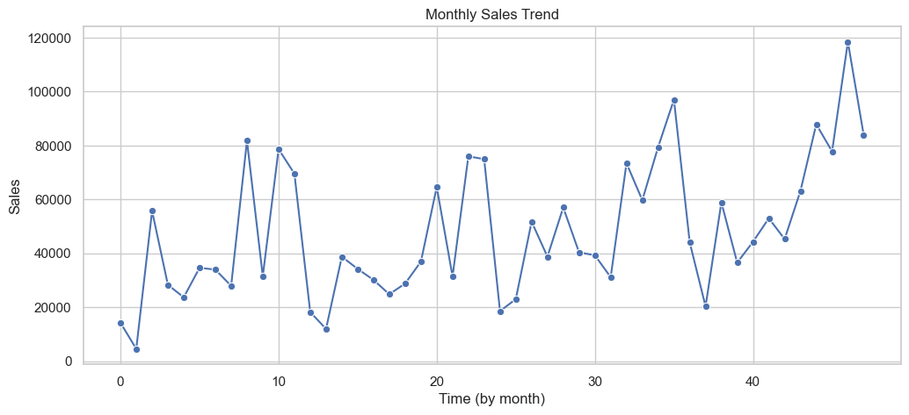
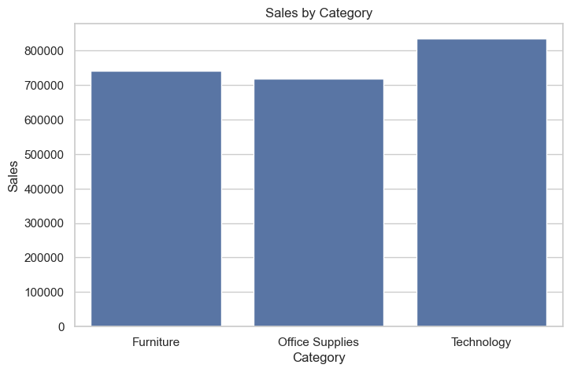
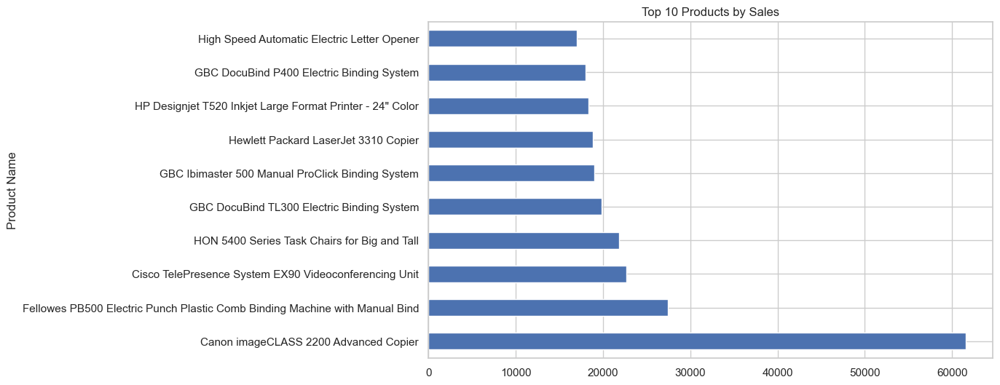
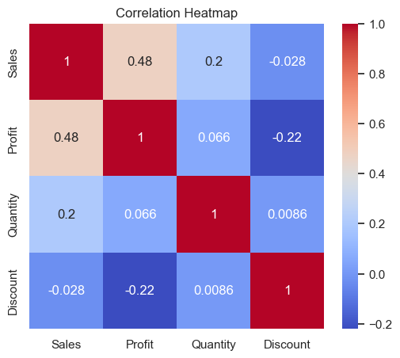

# E-commerce Sales Analysis

This mini-project analyzes sales data from an e-commerce dataset to uncover business insights.

## Technologies Used
- Python
- Pandas
- Matplotlib
- Seaborn

## Key Insights
- Sales are increasing over time 
- Technology category generates the highest profit 
- Higher discounts lead to lower profits 
- Technology is the top-performing product line 

---

## Visualizations

### Monthly Sales Trend


### Sales by Category


### Top 10 Products by Sales


### Correlation Heatmap


---

## Installation
```bash
pip install -r requirements.txt
```

## How to Run
1. Clone the repo  
2. Open `ecommerce_sales_analysis.ipynb` in Jupyter Lab or Jupyter Notebook  
3. The datasets (`sales_data.csv` and `cleaned_sales_data.csv`) are already included in the repo  
4. Run all cells to generate the analysis and visualizations  

